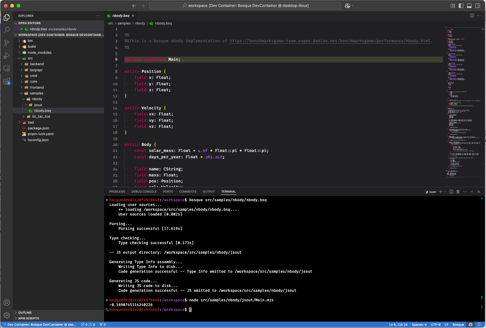
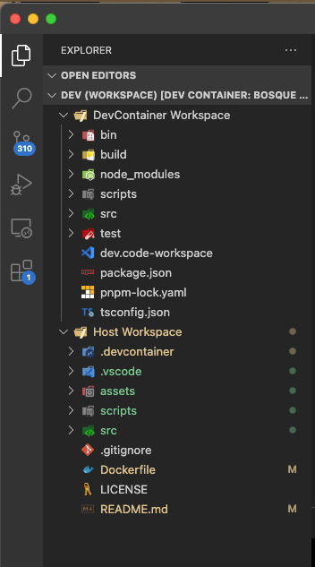
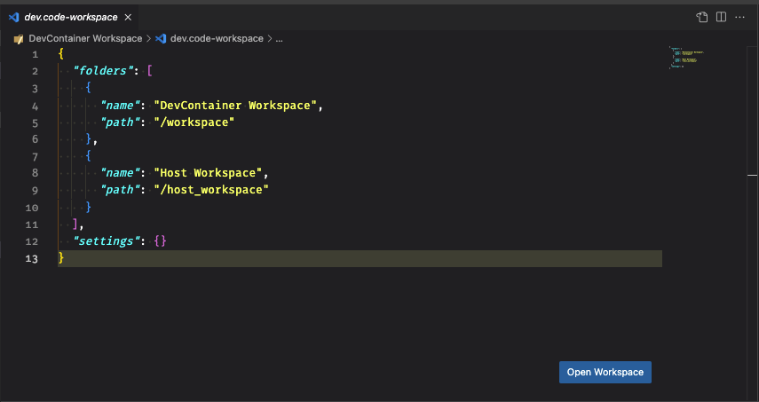
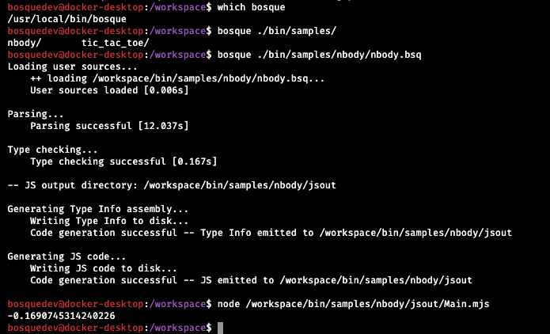
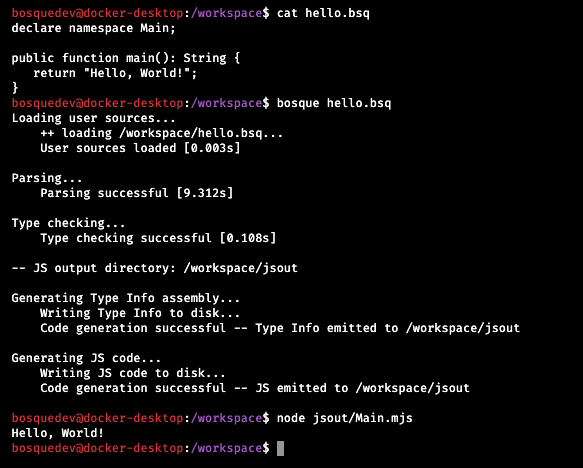

# Bosque Development Environment Dockerfile

This repository provides a Dockerfile to build a fully functional Bosque Development Environment. You can either use prebuilt Docker images or build your own image locally.


[](https://hub.docker.com/r/brakmic/bosquedev/)

## Prebuilt Docker Images

Prebuilt Docker images are available [here](https://hub.docker.com/r/brakmic/bosquedev).  
Pull the image directly using Docker:

```bash
docker pull brakmic/bosquedev:latest
```

## Building Your Own Image

To build the Docker image yourself:

1. Clone this repository.
2. Build the Docker image using the following command:

    ```bash
    docker build -t your_user_prefix/bosquedev:latest .
    ```

    The build process will automatically clone the [BosqueCore](https://github.com/BosqueLanguage/BosqueCore) repository during the build stage, so no additional manual steps are required.

## Running the Docker Container

Run the container interactively with a mounted volume to persist your session.

### For Linux/Mac:
```bash
docker run --rm -it -v $(pwd):/session your_user_prefix/bosquedev:latest
```

### For Windows Users:
- **PowerShell**:
  ```powershell
  docker run --rm -it -v ${PWD}:/session your_user_prefix/bosquedev:latest
  ```

- **Command Prompt (CMD)**:
  ```cmd
  docker run --rm -it -v %cd%:/session your_user_prefix/bosquedev:latest
  ```

- **Git Bash or WSL**:
  ```bash
  docker run --rm -it -v $(pwd):/session your_user_prefix/bosquedev:latest
  ```

## Using the Dockerfile in a Devcontainer

You can use the provided Dockerfile as a development container in VS Code to streamline development.

### What is a DevContainer?

A devcontainer is a [containerized development environment](https://code.visualstudio.com/docs/devcontainers/containers) that allows you to work in a consistent and isolated environment directly from your code editor.



### Setting Up the DevContainer

1. **Install Required Extensions**:
   - Install the [Dev Containers](https://marketplace.visualstudio.com/items?itemName=ms-vscode-remote.remote-containers) extension in VS Code.

2. **Open the Devcontainer Options**:
   - On **macOS**:
     - Open VS Code.
     - Click on the **View** menu > **Command Palette** or press `Cmd+Shift+P`.
   - On **Windows**:
     - Open VS Code.
     - Click on the **View** menu > **Command Palette** or press `Ctrl+Shift+P`.
   - In the Command Palette, search for and select `Dev Containers: Open Folder in Container...`.

3. **Select the Dockerfile**:
   - After selecting the folder containing your project, VS Code will prompt you to configure the devcontainer.
   - If prompted, select `From 'Dockerfile'`.

4. **Configure the DevContainer** (Optional):
   - Ensure there is a `.devcontainer` folder in the root of your project with a `devcontainer.json` file. If it does not exist, create it with the following content:

      ```json
      {
        "name": "Bosque DevContainer",
        "build": {
          "dockerfile": "../Dockerfile"
        },
        "workspaceFolder": "/workspace",
        "workspaceMount": "source=${localWorkspaceFolder},target=/host_workspace,type=bind,consistency=cached",
        "customizations": {
          "vscode": {
            "settings": {
              "files.exclude": {
                "**/.git": true,
                "**/.DS_Store": true
              }
            }
          }
        },
        "mounts": [
          "source=${localWorkspaceFolder}/scripts/setup-workspace.mjs,target=/workspace/scripts/setup-workspace.mjs,type=bind"
        ],
        "postCreateCommand": "node /workspace/scripts/setup-workspace.mjs && ln -sf /workspace/dev.code-workspace /home/bosquedev/.vscode-server/dev.code-workspace",
        "remoteUser": "bosquedev"
      }
      ```

5. **Build and Open the DevContainer**:
   - VS Code will automatically build the devcontainer and open it.
   - Once the build process is complete, the containerized development environment will be ready.

### Verifying the Environment

- Run `bosque` in the integrated terminal to ensure the command is globally available.
- Verify that the `/host_workspace` folder contains your project files.

### Optional: Using a VS Code Workspace with the DevContainer

In addition to the standard devcontainer setup, you have the option to create and use a VS Code workspace that includes both the devcontainer's `/workspace` directory and the mounted `/host_workspace` directory. This allows you to access and work on files from both the container and your local machine within the same workspace.



#### Benefits

- **Unified View:** Work on your project files and container-specific files simultaneously.
- **Ease of Access:** Navigate seamlessly between local and container environments without switching contexts.
- **Enhanced Productivity:** Streamline your development workflow by having all necessary files in one place.

#### Setting Up the Workspace

1. **Ensure DevContainer is Running:**
   - Follow the steps in the **Setting Up the DevContainer** section to build and open the devcontainer.

2. **Create the Workspace File:**
   - The devcontainer setup includes a script (`setup-workspace.mjs`) that generates a workspace file named `dev.code-workspace` containing both `/workspace` and `/host_workspace`.
   - This workspace file is typically located in the `/workspace` directory inside the container.

3. **Open the Workspace in VS Code:**
   - **Manual Method:**
     - After the devcontainer has been built and is running, locate the `dev.code-workspace` file within the container's `/workspace` directory.
     - In VS Code, go to **File** > **Open Workspace...** and navigate to the `dev.code-workspace` file to open it.
     - Alternatively, if the workspace file is accessible from your host machine (e.g., through a mounted volume), you can double-click the `dev.code-workspace` file in your file explorer to open it directly in VS Code.

     
   
   - **Using Symbolic Link:**
     - The `postCreateCommand` in `devcontainer.json` creates a symbolic link to the workspace file at `/home/bosquedev/.vscode-server/dev.code-workspace`.
     - In VS Code, you can open this workspace by navigating to **File** > **Open Workspace...** and selecting the linked `dev.code-workspace` file.

4. **Verify Workspace Contents:**
   - Once opened, the workspace should display both the `/workspace` and `/host_workspace` folders in the VS Code Explorer pane.
   - You can now work on files from both directories seamlessly.

#### Notes

- **Manual Activation:** Currently, the workspace file needs to be opened manually by double-clicking it in VS Code. This ensures that you have full control over when and how the workspace is activated.
- **Consistency:** Ensure that the workspace file is kept up-to-date if you make changes to the devcontainer configuration or project structure.

## Features

- **Fully Functional Environment**: Includes all dependencies to develop and run Bosque applications.
- **Global `bosque` Command**: The `bosque` command is globally available, enabling straightforward execution of Bosque scripts.
- **Interactive Development**: Easily test and debug Bosque programs interactively using the container.

## Usage Examples

### Running Bosque Applications




## Additional Resources

- [Bosque-Language (Unofficial)](https://bosque-lang.org)
- [Bosque Language GitHub Organization](https://github.com/BosqueLanguage)

## Contributing

Contributions are welcome! Feel free to submit issues or pull requests to improve this repository.

## License

This project is licensed under the [MIT License](./LICENSE).
